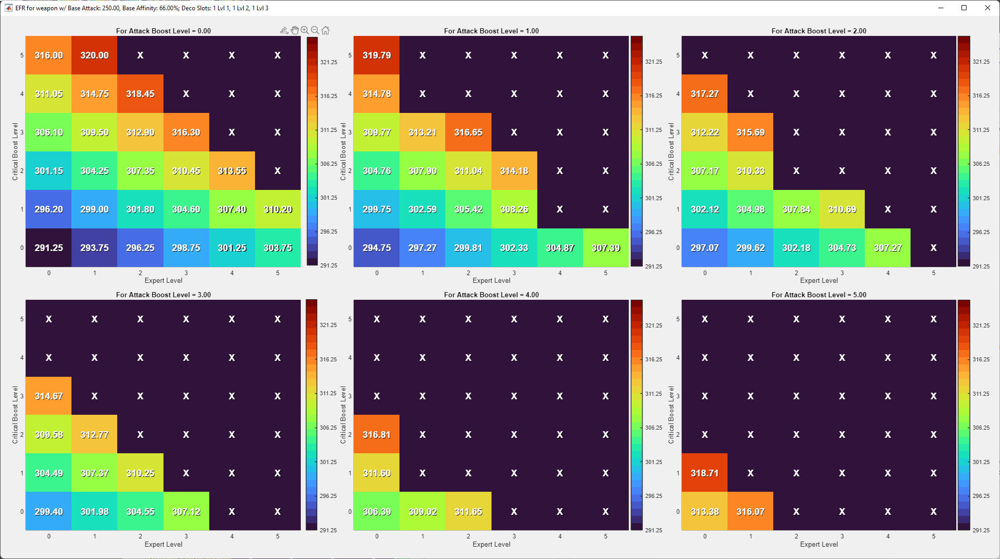
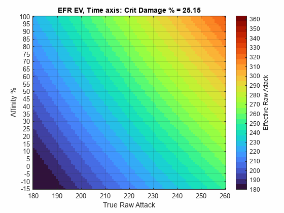
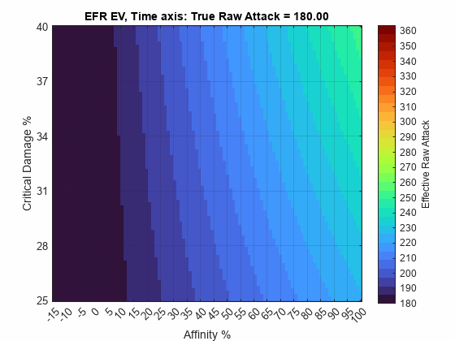
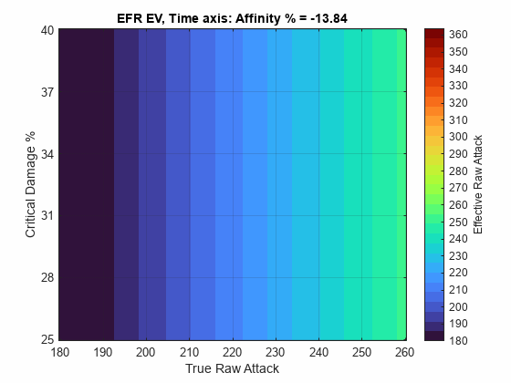

PlotWeaponGemEFR.m is probably what you are interested in. Once added to your
MATLAB path, you can call it using, for example:

PlotWeaponGemEFR;

Or by simply opening the script and clicking Run.

The user interface has 5 edit boxes for you to input your weapon stats, and you
can click Update to redraw the plots for them.

The result should look something like: (after you expand the window)

PlotEFR.mlx is the live script I used to make the EFR heatmap animations.

